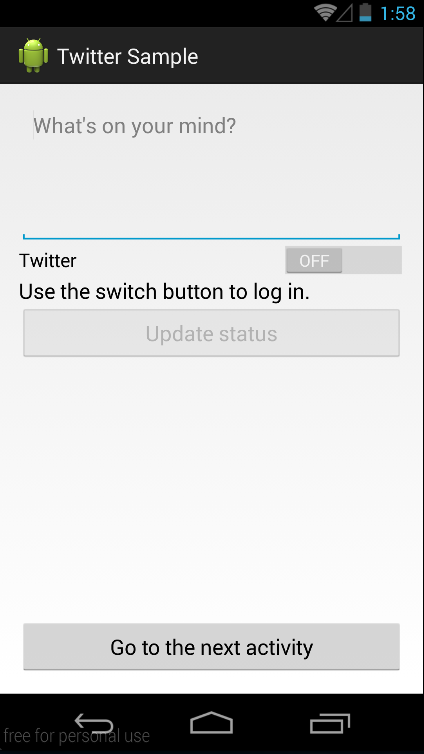

twitter4j Android Sample
========================


twitter4j sample application for Android.



Libraries: [Otto] & [Butter Knife]
To get started please edit the twitter4j.properties oauth.consumerKey, oauth.consumerSecret & oauth.callbackUrlConsumer with your own.

```sh
oauth.consumerKey=xxxx
oauth.consumerSecret=yyyy
oauth.callbackUrl=http://www.example.com/oauth/twitter/callback
```

Based on [Android-Twitter-Login-Sample]

## Twitter Application
To get the Consumer Key & Consumer Secret, you have to create an app in Twitter via.

Please follow the steps below:

### New App

* Log into  the [Twitter Developers] section.

 > If you don't already have an account, you can login with your normal Twitter credentials
Go to [Create an app]

* Fill in the details of the application you'll be using to connect with the API

 > Your application **name must be unique**. If someone else is already using it, you won't be able to register your application until you can think of something that isn't being used.

* Click on **Create your Twitter application**

* Details of your new app will be shown along with your consumer key and consumer secret.

* If you need access tokens, scroll down and click **Create my access token**

 > The page will then refresh on the "Details" tab with your new access tokens. You can recreate these at any time if you need to.
By default your apps will be granted for read-only access. To change this, go to the Settings tab and change the access level required in the "Application Type" section.

### Existing app

* To get the consumer and access tokens for an existing application, go to [My applications] - (which is available from the menu in the upper-right).


License
------
The MIT License (MIT)

Copyright (c) 2014 Antonio Abad

Permission is hereby granted, free of charge, to any person obtaining a copy
of this software and associated documentation files (the "Software"), to deal
in the Software without restriction, including without limitation the rights
to use, copy, modify, merge, publish, distribute, sublicense, and/or sell
copies of the Software, and to permit persons to whom the Software is
furnished to do so, subject to the following conditions:

The above copyright notice and this permission notice shall be included in all
copies or substantial portions of the Software.

THE SOFTWARE IS PROVIDED "AS IS", WITHOUT WARRANTY OF ANY KIND, EXPRESS OR
IMPLIED, INCLUDING BUT NOT LIMITED TO THE WARRANTIES OF MERCHANTABILITY,
FITNESS FOR A PARTICULAR PURPOSE AND NONINFRINGEMENT. IN NO EVENT SHALL THE
AUTHORS OR COPYRIGHT HOLDERS BE LIABLE FOR ANY CLAIM, DAMAGES OR OTHER
LIABILITY, WHETHER IN AN ACTION OF CONTRACT, TORT OR OTHERWISE, ARISING FROM,
OUT OF OR IN CONNECTION WITH THE SOFTWARE OR THE USE OR OTHER DEALINGS IN THE
SOFTWARE.


[Twitter Developers]:https://dev.twitter.com/
[Create an app]:https://apps.twitter.com/app/new
[My applications]:https://dev.twitter.com/apps
[Android-Twitter-Login-Sample]:https://github.com/octa-george/Android-Twitter-Login-Sample
[Otto]:http://square.github.io/otto/
[Butter Knife]:http://jakewharton.github.io/butterknife/
